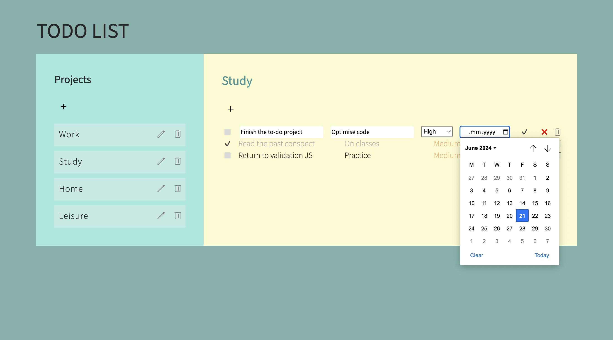

# Todo List

This project is a part of the [Odin](https://www.theodinproject.com) curriculum on programming. This is a practical [task](https://www.theodinproject.com/lessons/node-path-javascript-todo-list) to sum up several JavaScript topics.

This is a web application that allows to keep organized task lists (todos) that have several properties: title, description, due date and priority. 
The user can: 

* View all projects.
* Edit a project's name.
* Delete a project with all its todos.
* View all todos in each project.
* Edit any todo's property.
* Delete a todo.

The list can also be kept on the user's local storage via lib.dom.d.ts.

Live version can be found [here](https://mountainflockstodolist.netlify.app).

## Technologies used: 

* JavaScript
* HTML
* CSS

## Display
 
